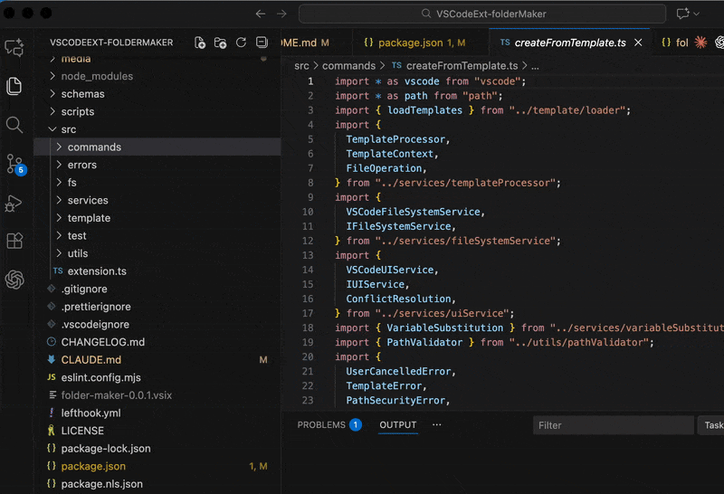

# Folder Maker

> 스마트 변수 치환 기능을 가진 템플릿 기반 폴더 및 파일 생성 도구

🌍 **Languages:** [English](README.md) | [한국어](README.ko.md)

[](https://github.com/yhslog/VSCodeExt-folderMaker)
[](LICENSE)

## ✨ 주요 기능

- 🎯 **템플릿 기반 스캐폴딩** - 폴더에서 우클릭하여 템플릿으로 생성
- 🔄 **스마트 변수 치환** - 자동 케이스 변환 (camelCase, kebabCase, pascalCase)
- ⚙️ **워크스페이스 & 전역 템플릿** - 프로젝트별 또는 공유 템플릿
- 🔒 **보안 우선** - 경로 탐색 공격 방지, 인젝션 방지
- 🌍 **다국어 지원** - 영어 및 한국어 지원

## 🎥 데모



> 폴더 우클릭 → 템플릿 선택 → 이름 입력 → 파일 즉시 생성

## 🚀 빠른 시작

### 설치 방법

1. [VS Code 마켓플레이스](https://marketplace.visualstudio.com/items?itemName=yhslog.folder-maker)에서 다운로드
2. 또는 VSIX 설치: `code --install-extension folder-maker-0.0.1.vsix`

### 사용 방법

**방법 1: 컨텍스트 메뉴**
1. 탐색기에서 폴더 우클릭
2. "폴더 템플릿에서 생성" 선택
3. 템플릿 선택
4. 폴더 이름 입력
5. 완료! ✅

**방법 2: 키보드 단축키**
- Windows/Linux: `Ctrl+Alt+F`
- macOS: `Cmd+Alt+F`

**방법 3: 명령 팔레트**
- `Ctrl+Shift+P` (또는 `Cmd+Shift+P`) 누르기
- "폴더 템플릿에서 생성" 입력

## 📝 템플릿 설정

### 워크스페이스 템플릿 (권장)

프로젝트에 `.vscode/folder-maker.json` 파일 생성:

```json
{
  "templates": [
    {
      "name": "React Component",
      "description": "테스트 포함 TypeScript React 컴포넌트",
      "files": [
        {
          "path": "index.tsx",
          "content": "export { ${folderName|pascalCase} } from './${folderName|pascalCase}'\n"
        },
        {
          "path": "${folderName|pascalCase}.tsx",
          "content": "export const ${folderName|pascalCase} = () => {\n  return <div>${folderName}</div>\n}\n"
        },
        {
          "path": "__tests__/${folderName|pascalCase}.test.tsx",
          "content": "import { ${folderName|pascalCase} } from '../${folderName|pascalCase}'\n\ndescribe('${folderName|pascalCase}', () => {\n  it('renders', () => {\n    // 테스트 작성\n  })\n})\n"
        }
      ]
    }
  ]
}
```

### 전역 템플릿

VS Code 설정(`settings.json`)에 추가:

```json
{
  "folderMaker.templates": [
    {
      "name": "Node.js Service",
      "description": "테스트 포함 TypeScript 서비스",
      "files": [
        {
          "path": "${folderName|camelCase}.service.ts",
          "content": "export class ${folderName|pascalCase}Service {\n  // TODO: 구현하기\n}\n"
        },
        {
          "path": "${folderName|camelCase}.service.test.ts",
          "content": "import { ${folderName|pascalCase}Service } from './${folderName|camelCase}.service'\n\ndescribe('${folderName|pascalCase}Service', () => {\n  it('정의되어야 함', () => {\n    expect(new ${folderName|pascalCase}Service()).toBeDefined()\n  })\n})\n"
        }
      ]
    }
  ]
}
```

## 🔤 변수 치환

| 변수 | 입력: `UserProfile` | 출력 |
|----------|---------------------|--------|
| `${folderName}` | - | `UserProfile` |
| `${folderName\|camelCase}` | - | `userProfile` |
| `${folderName\|kebabCase}` | - | `user-profile` |
| `${folderName\|pascalCase}` | - | `UserProfile` |

### 예제

```typescript
// 템플릿
export const ${folderName|camelCase} = () => {}

// 입력: "MyComponent"
// 결과:
export const myComponent = () => {}
```

## 🛡️ 보안

- **경로 탐색 공격 방지** - `../../../etc/passwd` 공격 차단
- **인젝션 방지** - `${malicious}` 코드 정제
- **리소스 제한** - 최대 100개 파일, 파일당 10MB, 총 100MB

## 📖 문서

- [CHANGELOG](CHANGELOG.md) - 버전 히스토리
- [CLAUDE.md](CLAUDE.md) - 아키텍처 가이드
- [LICENSE](LICENSE) - MIT 라이선스

## 🔧 개발

### 환경 설정

```bash
npm install
```

### 확장 실행

VS Code에서 `F5`를 눌러 확장 개발 호스트 실행

### 테스트

```bash
npm run test:run        # 모든 테스트 실행 (160개 테스트)
npm run test:coverage   # 커버리지 리포트 생성
npm run lint:check      # ESLint 체크
npm run format:check    # Prettier 체크
```

### 빌드

```bash
npm run compile         # TypeScript 컴파일
vsce package           # VSIX 생성
```

## 🤝 기여하기

기여를 환영합니다! 개발 가이드는 [CLAUDE.md](CLAUDE.md)를 참고하세요.

## 📄 라이선스

[MIT](LICENSE) © 2025 yhslog

## 🙏 감사의 말

[Claude Code](https://claude.com/claude-code)로 제작되었습니다.
